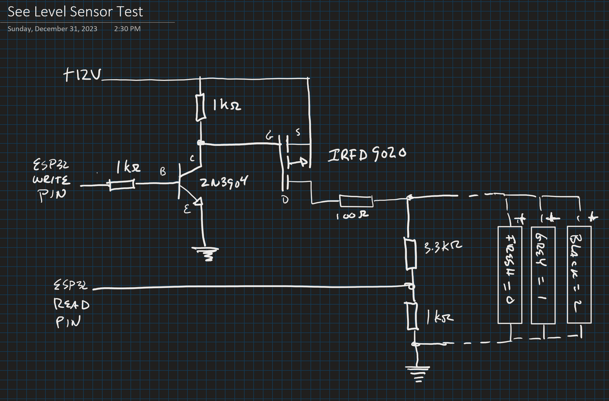

## 3.3V <-> 12V SeeLevel Interface

To interface, I built a level-shifter using this forum post as a guide:

https://forums.raspberrypi.com/viewtopic.php?t=119614

Based on available components, and to make sure that the read pin sees no more than 3.3v, resistor values for voltage divider on read pin were changed to 3k & 1k. This increases the pull-down rate on the initial trigger pulses. 

This circuit works fairly well at voltages > 12.5 with a 200ohm resistor, >12.0v with a 100ohm. Generates read errors at lower voltages.

Tested with 100ohm resistor, three sensors, two of which were wired with 20ft. of 20ga. wire.

